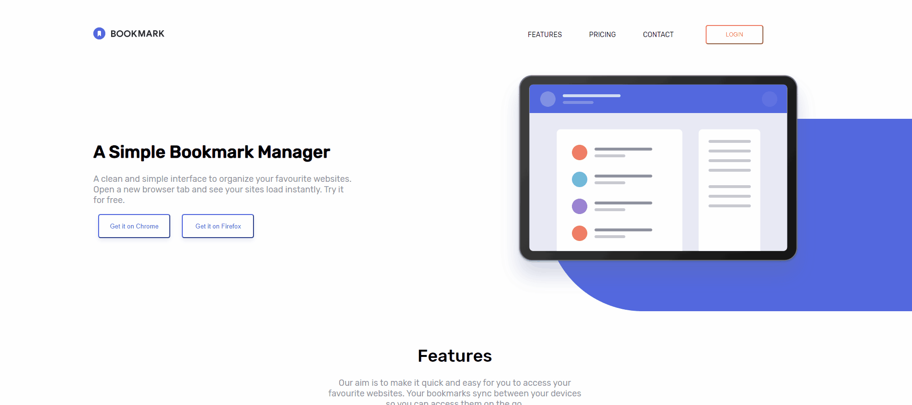

# HTML & CSS - Bookmark landing page

## Welcome! 👋

Thanks for checking out this front-end coding project. Here is a link to a [LIVE DEMO](https://bookmark-landing-page-liard.vercel.app/)
The design reference was provided to me by [Frontend Mentor](https://www.frontendmentor.io/) , a site that hosts challenges that allow you to improve your skills in a real-life workflow.

## The Objective

Given the design mockups from Frontend Mentor, my goal was to build a site that matched those designs

- The site must be responsive
- Match design mockups

This is another example of what kind of work I am capable of doing, for clients or companies. If you need to see the rest of my work [click here](https://adrianramos.dev/)
